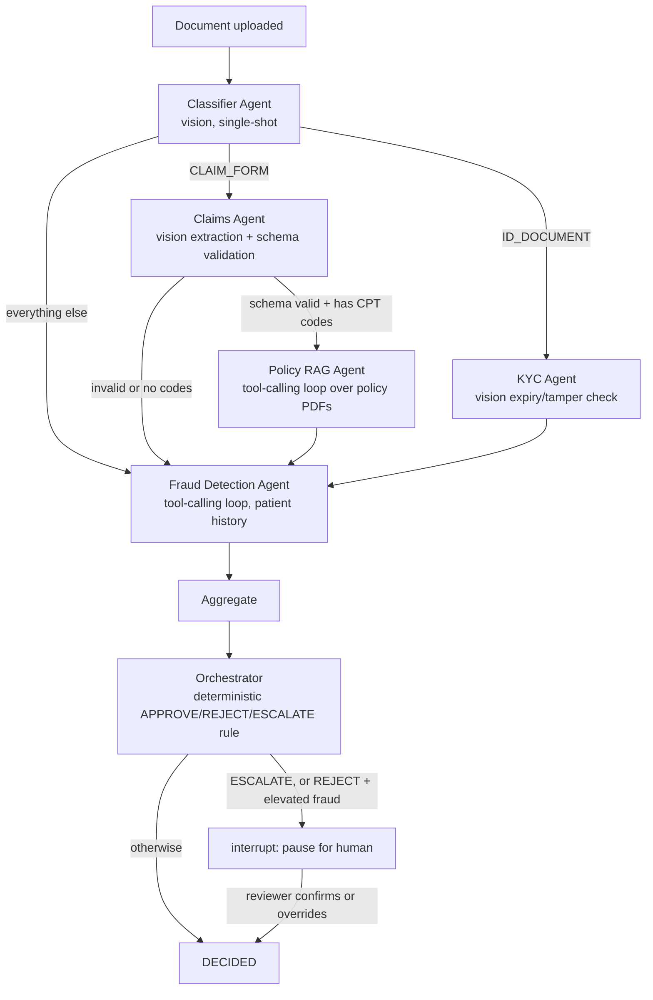
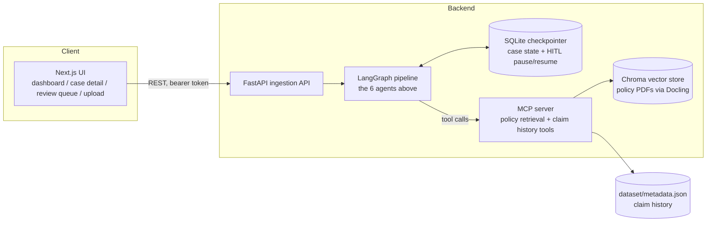

# MediShield — Multi-Agent Document Intake System

A CodeBasics capstone project (Assignment 02: Multi-Agent Document Intake
System). MediShield is an AI-powered claims intake pipeline: a document
(claim form, ID, discharge summary, prescription, or policy amendment)
comes in, six specialist agents built on Claude examine it from different
angles, and a deterministic decision rule turns their findings into
APPROVE / REJECT / ESCALATE — with a human reviewer as the final word on
anything ambiguous or high-stakes.

**Full documentation index:**

| Doc | What it's for |
|---|---|
| `README.md` (this file) | What this is, how to run it, top-level architecture |
| [EVAL_REPORT.md](EVAL_REPORT.md) | The full 155-document evaluation run's scores |
| [transcripts/](transcripts/) | Real, captured examples: a clean case, a human-review pause/resume, adversarial security tests |

---

## What it does

A user (or the API) submits a scanned document. The system:

1. **Classifies** it (claim form / ID / discharge summary / prescription /
   policy amendment / unrecognized).
2. Routes it to the specialists that document type actually needs — an ID
   only needs identity verification; a claim form needs extraction and
   coverage lookup; nothing needs all of them.
3. Every path converges on **fraud screening**, then a **deterministic
   decision rule** (not another LLM guess) turns every agent's findings
   into APPROVE, REJECT, or ESCALATE.
4. Anything ESCALATEd — or REJECTed with an elevated fraud score — **pauses
   for a human** before it's final. A reviewer can confirm the computed
   decision or override it, and that override is recorded, never silently
   discarded.

## Why multi-agent, and why this particular split

Six narrow specialists instead of one do-everything prompt, because each
one needs a genuinely different skill and a different amount of judgment:

| Agent | Job | Why it's separate |
|---|---|---|
| Classifier | "What kind of document is this?" | Every document needs this first, and nothing downstream can start without it |
| KYC | "Is this identity document valid?" | Only ID documents need this — routing it universally would waste calls |
| Claims | "Extract the billing fields" | Structured extraction is a different skill from judgment; validation is deterministic code, not another LLM call |
| Policy RAG | "Is this covered, and at what rate?" | Needs to search real policy documents, not just reason from a prompt |
| Fraud Detection | "Does this look suspicious?" | Needs the patient's claim history, a different data source than any other agent touches |
| Orchestrator | "APPROVE / REJECT / ESCALATE?" | The one place all the other agents' findings are combined — kept deterministic on purpose (see below) |

**The recurring design choice, everywhere in this codebase:** wherever a
decision needs to be auditable and reproducible — the final
APPROVE/REJECT/ESCALATE call, whether a claim's schema is valid, whether a
fraud score counts as LOW/MEDIUM/HIGH — that decision is **plain
deterministic Python, not an LLM call**. The LLM's job is judgment where
judgment is actually needed (does this look tampered? does this bundle of
procedures make clinical sense together?) and writing the human-readable
narrative explaining *why*. A business-critical decision that could drift
from one LLM call to the next, with no way to explain why, is the wrong
place to spend a model call — see `backend/agents/orchestrator.py` for
where this rule actually lives in code.

## Architecture





Every agent, plus the Orchestrator and MCP tool calls, talks to
**Anthropic's Claude models** — Sonnet 5 for routine judgment calls,
escalating to Opus 5 only when a case's own signals (fraud score in an
ambiguous band, or already ESCALATE-bound) say it's worth the stronger
model — see `backend/agents/orchestrator.py` and
`backend/agents/fraud_detection.py` for exactly how that escalation
trigger is computed.

## Tech stack

- **Orchestration:** LangGraph (`StateGraph`, `interrupt()`/`Command(resume=...)` for human-in-the-loop, `SqliteSaver` checkpointing)
- **LLM:** Anthropic Claude (`langchain-anthropic`), prompt caching, `create_agent` tool-calling loops for the two agents that need to search external state
- **RAG:** Docling (PDF → structured chunks) + ChromaDB (vector search) over the two policy plan documents
- **Tool protocol:** MCP (Model Context Protocol) — the Policy RAG and Fraud Detection agents' tools are exposed as real MCP tools, not hardcoded Python imports
- **API:** FastAPI, bearer-token auth, background-thread processing so uploads return immediately
- **Frontend:** Next.js 16 (App Router), TypeScript, Tailwind CSS v4
- **Security:** input-side prompt-injection-resistant system prompts + output-side scanning, PII/PHI redaction at the RAG retrieval boundary, tool-docstring scanning before registering any tool, HTML-escaping helper for the UI render boundary — all 5 categories from the assignment's security requirement
- **Evals:** a harness scored against `dataset/metadata.json`'s ground truth, honest about which of the assignment's 6 weighted criteria are actually auto-scorable

## Project layout

```
backend/
  agents/          the 6 agent implementations (classifier, kyc, claims, policy_rag, fraud_detection, orchestrator)
  graph/           LangGraph wiring (pipeline.py), the SQLite checkpointer
  models/          CaseState and every agent's typed output schema — the shared contract
  rag/             Docling ingestion + Chroma retrieval for the policy PDFs
  fraud/           the claim-history lookup Fraud Detection uses
  security/        the 5 security-module mitigations
  mcp_server/      the MCP server + the LangChain-compatible client adapter that calls it
  evals/           ground truth derivation, scoring, the harness, report formatting
  api/             the FastAPI app
  scripts/         one-off runnable entry points (smoke tests, the eval runner, the MCP server)
  tests/           193 tests, all deterministic/mocked — zero Anthropic spend to run
frontend/
  src/app/         the 4 pages: dashboard, case detail, review queue, upload
  src/lib/         the typed API client + TypeScript mirrors of the backend's Pydantic models
  src/components/  StatusBadge/DecisionBadge, the HITL review-actions widget
dataset/           155 synthetic documents + 2 policy PDFs + ground-truth metadata.json (not in this repo — see "Get the dataset" below)
transcripts/       real captured examples (see the docs index above)
```

## Running it

### Prerequisites

- Python 3.11+, [`uv`](https://docs.astral.sh/uv/)
- Node.js 18+ (for the frontend)
- An Anthropic API key

### 1. Get the dataset

`dataset/` (155 synthetic documents, the 2 policy PDFs, and
`metadata.json`) is **not committed to this repo** — it's ~125MB of
generated images, excluded deliberately to keep the repo itself small.
Regenerate it locally with the four generator scripts at the repo root
(pure Python, no Anthropic calls, a few seconds to run), **in this exact
order**:

```bash
uv run python generate_docs.py           # dataset/{claim_forms,...}/ + metadata.json
uv run python generate_gold_policy.py     # dataset/policies/medishield_gold_plan.pdf
uv run python generate_silver_policy.py   # dataset/policies/medishield_silver_plan.pdf
uv run python generate_unknown.py         # dataset/unknown/ — must run after generate_docs.py
```

`scripts_overview.txt` documents exactly what each script produces if you
want the detail. Everything below (tests, policy ingestion, the eval
suite, uploading a document through the UI) assumes `dataset/` exists.

### 2. Backend setup

```bash
uv sync
cp .env.example .env
# edit .env and set ANTHROPIC_API_KEY
```

Ingest the policy PDFs into Chroma once (only needed the first time, or
after editing a policy PDF):

```bash
uv run python -m backend.scripts.ingest_policies
```

Run the test suite (193 tests, fully mocked — no API key needed, no cost):

```bash
uv run pytest backend/tests/ -q
```

Start the API:

```bash
uv run uvicorn backend.api.app:app --host 127.0.0.1 --port 8000
```

### 3. Frontend setup

```bash
cd frontend
npm install
npm run dev
```

Open http://localhost:3000 — it talks to the API at `localhost:8000` with
the dev bearer token (`dev-local-token`, matching `.env.example`'s
default) unless overridden in `frontend/.env.local`.

### 4. Try it

- Upload a document from `dataset/claim_forms/`, `dataset/id_documents/`,
  etc. through the Upload page, or `POST /cases` directly.
- Watch it move through the pipeline on the dashboard.
- If it lands on `AWAITING_REVIEW`, confirm or override it from the case
  detail page's review panel.

Every real Anthropic call is logged to `storage/token_usage.jsonl` — see
`backend/scripts/token_usage_report.py` for a cost summary, and
`TOKEN_BUDGET.md`/`TOKEN_USAGE_LOG.md` for this project's own running
total.

## Results

The full 155-document dataset, evaluated against `dataset/metadata.json`'s
ground truth (`EVAL_REPORT.md` has the complete breakdown):

| Criterion | Score |
|---|---|
| Classification Accuracy | 95.5% |
| Extraction Completeness | 96.0% |
| Decision Correctness | **78.1%** (assignment's passing bar is 60%) |

193 backend tests passing, all deterministic (mocked LLM calls) — the test
suite validates code logic, not model behavior, and costs nothing to run
repeatedly.

## Known limitations (documented, not hidden)

- **KYC tamper detection is deliberately conservative** — it missed all 3
  real `tampered_id` test cases in the eval. This is a considered
  trade-off (see `backend/agents/kyc.py`'s own docstring): an aggressive
  tamper detector false-positived on every clean document during early
  testing, and blocking real customers is worse than missing a subtle
  synthetic artifact.
- **Fraud Detection can't see cross-document signals** — its tool only
  exposes claim-form metadata, so it structurally cannot catch a
  discharge summary's readmission date or a name mismatch regardless of
  which document triggers a case. Documented, not silently ignored, in
  `backend/evals/ground_truth.py`.
- **WebSocket live status streaming** was not built — the assignment
  brief lists it as a bonus challenge, not a required component.
- Three bugs found by the full eval run were investigated and closed out:
  one turned out to be dataset staleness (not a code defect at all — the
  test fixtures' printed expiry dates predated the dataset's own
  generation timestamp), the other two got real fixes with new tests
  (see `backend/agents/vision_utils.py` and
  `backend/agents/orchestrator.py`).

## License

MIT — see `LICENSE`.
